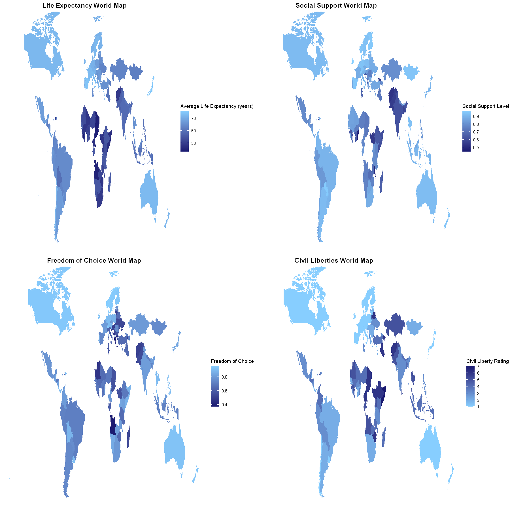

# Data Visualization - Big Idea

<i>People’s life expectancy and beliefs are significantly affected by the freedoms and support offered by their Government and community.</i>

Throughout the world the levels of freedom, corruption, and social support vary considerably. Many already understand that civil liberties and social support play a role in a citizen’s wellbeing, however the true impact that these factors play on a person’s life may not be fully grasped.  
With this in mind, this story attempts to convey the importance of civil liberties, social support, and the levels of corruption on a population’s life expectancy, freedom, and confidence in the state itself. This story is intended primarily for members of the United Nation’s Human Rights Council (UNHRC), as their policies and actions can address these issues at their source, however this story has also been designed such that a general viewer can understand the message clearly.  
The UNHRC is an inter-governmental organisation within the United Nations responsible for promoting and protecting human rights and civil liberties across the globe. As the chief body for human rights and civil liberty protection, they are the best audience for this story, as they can most effectively formulate policies and strategies to address it. Contacting them is simple, with multiple methods of reaching out.  
The insights and message conveyed through this story are of the utmost importance, as people’s health, wellbeing, and life itself are affected. This story can serve to teach people of the significance of factors such as a populations civil liberties and social support, and as such has the opportunity to improve the quality of people’s lives through effective policy.  

<h3>Data Exploration Summary</h3>
Note that the full exploration graph collection can be viewed from the Graphs folder.

<h3>Data Story Summary</h3>

